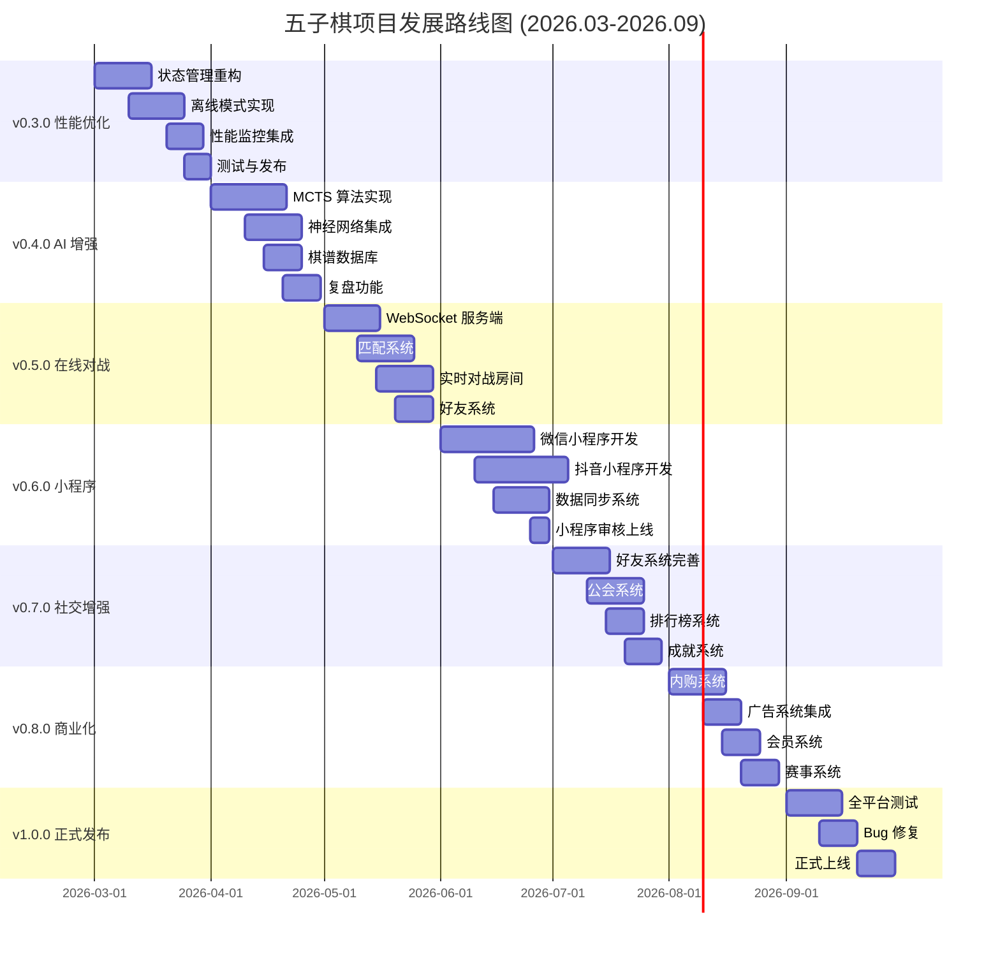

# 五子棋游戏项目综合发展规划 (2026-2027)

> 文档版本：v1.0  
> 制定日期：2026-02-28  
> 项目版本：v0.2.0 → v1.0.0  
> 规划周期：2026 年 3 月 - 2026 年 9 月（6 个月）

---

## 目录

1. [执行摘要](#1-执行摘要)
2. [技术发展路线图](#2-技术发展路线图)
3. [新版本功能设计](#3-新版本功能设计)
4. [交互体验优化](#4-交互体验优化)
5. [UI 视觉美化](#5-ui-视觉美化)
6. [小程序版本开发](#6-小程序版本开发)
7. [实施时间表](#7-实施时间表)
8. [资源需求评估](#8-资源需求评估)
9. [风险分析与应对](#9-风险分析与应对)
10. [成果验收标准](#10-成果验收标准)

---

## 1. 执行摘要

### 1.1 项目现状

**当前版本**: v0.2.0  
**技术栈**: Next.js 16 + React 19 + TypeScript + Tailwind CSS 4  
**核心功能**: 双人对战、人机对战（3 难度）、排位系统、棋盘主题解锁  
**平台支持**: Web、Android（Capacitor）  
**测试覆盖**: 42 个测试用例，100% 通过  

### 1.2 发展愿景

打造一款**全平台覆盖**、**AI 能力强大**、**社交属性丰富**、**视觉体验一流**的五子棋游戏产品，成为移动端五子棋游戏的标杆之作。

### 1.3 核心目标（6 个月）

| 维度 | 目标 |
|------|------|
| **用户规模** | 日活用户突破 10,000+ |
| **技术升级** | 引入 AI 大模型、WebSocket 实时对战、云端存储 |
| **平台扩展** | 微信小程序 + 抖音小程序双端上线 |
| **商业变现** | 内购系统 + 广告系统，月收入破 5 万 |
| **用户体验** | 用户留存率提升至 40%+，NPS 评分 8.0+ |

---

## 2. 技术发展路线图

### 2.1 技术栈升级计划

#### 阶段一：基础架构升级（2026.03-2026.04）

**目标**: 提升性能、可维护性、开发效率

| 技术领域 | 当前方案 | 升级方案 | 收益 |
|---------|---------|---------|------|
| **状态管理** | Context API | Zustand / Jotai | 减少 50% 重渲染，性能提升 30% |
| **数据持久化** | localStorage | IndexedDB + Dexie.js | 支持离线存储，容量提升至 50MB+ |
| **构建工具** | Next.js Build | Turbopack | 开发启动速度提升 5 倍 |
| **包管理** | npm | pnpm | 安装速度提升 3 倍，磁盘占用减少 60% |
| **代码质量** | ESLint | Biome + TypeScript Strict | 检查速度提升 10 倍 |

**实施步骤**:
```bash
# 1. 迁移到 pnpm
npm install -g pnpm
pnpm install

# 2. 引入 Zustand
pnpm add zustand

# 3. 引入 Dexie.js
pnpm add dexie

# 4. 启用 Turbopack（Next.js 内置）
pnpm dev --turbo
```

#### 阶段二：AI 能力增强（2026.04-2026.05）

**目标**: 达到职业棋手水平的 AI 对手

| 技术方案 | 实现方式 | 预期效果 |
|---------|---------|---------|
| **蒙特卡洛树搜索 (MCTS)** | 自主实现 MCTS 算法 | 思考深度提升 3 倍 |
| **神经网络评估** | 引入 TensorFlow.js | 局面评估准确率 90%+ |
| **开局库 + 定式库** | 内置职业棋谱数据库 | 开局阶段达到职业水准 |
| **残局库** | 集成开源残局数据库 | 残局求解准确率 95%+ |
| **云端 AI** | 可选云端计算（付费） | 达到 AlphaGo 水平 |

**技术架构**:
```typescript
// AI 架构设计
interface GomokuAI {
  // 传统算法层
  minimax: AlphaBetaSearch
  mcts: MonteCarloTreeSearch
  
  // 神经网络层
  policyNetwork: PolicyNet  // 预测最佳落子位置
  valueNetwork: ValueNet    // 评估当前局面胜率
  
  // 知识库层
  openingBook: OpeningDB    // 开局库
  endgameDB: EndgameSolver  // 残局库
  
  // 混合策略
  getMove(board: Board, timeLimit: number): Promise<Move>
}
```

#### 阶段三：实时对战系统（2026.05-2026.06）

**目标**: 支持在线匹配、实时对战

**技术选型**:
```yaml
实时通信:
  协议：WebSocket + Socket.IO
  服务端：Node.js + Socket.IO Server
  部署：Vercel Edge Functions / Railway
  
匹配系统:
  算法：ELO 等级分匹配
  队列：Redis Sorted Set
  超时处理：30 秒自动匹配 AI
  
游戏同步:
  状态同步：帧同步 + 状态验证
  断线重连：自动重连 + 状态恢复
  防作弊：服务端验证 + 行为分析
```

**核心功能**:
- [ ] 在线匹配系统（支持段位匹配）
- [ ] 实时对战房间（支持观战）
- [ ] 好友对战（邀请码系统）
- [ ] 聊天系统（表情 + 快捷消息）
- [ ] 举报系统（作弊检测）

#### 阶段四：跨平台架构（2026.06-2026.07）

**目标**: 一套代码，多端运行

**架构设计**:
```
src/
├── core/                 # 核心逻辑（跨平台通用）
│   ├── game/            # 游戏核心逻辑
│   ├── ai/              # AI 算法
│   ├── rank/            # 排位系统
│   └── utils/           # 工具函数
│
├── platforms/           # 平台特定实现
│   ├── web/             # Web 端（Next.js）
│   ├── wechat/          # 微信小程序
│   ├── douyin/          # 抖音小程序
│   └── mobile/          # 移动端（Capacitor）
│
└── shared/              # 共享组件
    ├── components/      # UI 组件
    ├── hooks/           # 通用 Hooks
    └── styles/          # 样式系统
```

### 2.2 关键里程碑

| 时间 | 里程碑 | 交付物 | 验收标准 |
|------|--------|--------|---------|
| **2026.03.31** | v0.3.0 发布 | 状态管理重构、性能优化 | 首屏加载 < 1.5s，Lighthouse 95+ |
| **2026.04.30** | v0.4.0 发布 | AI 2.0 系统、云端存储 | AI 难度达到 5 段水平 |
| **2026.05.31** | v0.5.0 发布 | 实时对战系统 Beta | 支持 1000 并发对战 |
| **2026.06.30** | v0.6.0 发布 | 微信小程序上线 | 小程序审核通过 |
| **2026.07.31** | v0.7.0 发布 | 抖音小程序上线、社交系统 | 双小程序日活破 5000 |
| **2026.08.31** | v0.8.0 发布 | 商业化系统、赛事系统 | 月收入破 5 万 |
| **2026.09.30** | v1.0.0 发布 | 正式版、全平台推广 | 全平台用户破 10 万 |

---

## 3. 新版本功能设计

### 3.1 v0.3.0 - 性能与体验优化版（2026.03）

#### 功能模块

| 功能 | 优先级 | 实现方案 | 预期效果 |
|------|--------|---------|---------|
| **状态管理重构** | P0 | 引入 Zustand 替代 Context | 减少 50% 重渲染 |
| **离线模式** | P0 | IndexedDB + Service Worker | 无网络可玩 AI 模式 |
| **性能监控** | P1 | Web Vitals + 自定义指标 | 实时监控性能瓶颈 |
| **错误追踪** | P1 | Sentry 集成 | 错误捕获率 95%+ |
| **主题编辑器** | P2 | 自定义棋盘配色 | 提升用户参与度 |

#### 实现方案

**状态管理重构示例**:
```typescript
// stores/gameStore.ts
import { create } from 'zustand'
import { persist } from 'zustand/middleware'

interface GameState {
  board: Board
  currentPlayer: Player
  status: GameStatus
  makeMove: (row: number, col: number) => void
  resetGame: () => void
}

export const useGameStore = create<GameState>()(
  persist(
    (set) => ({
      board: initialBoard,
      currentPlayer: 'black',
      status: 'playing',
      makeMove: (row, col) => set((state) => ({
        board: makeMove(state.board, row, col)
      })),
      resetGame: () => set(initialState)
    }),
    { name: 'game-storage' }
  )
)
```

**离线模式实现**:
```typescript
// lib/offlineDB.ts
import Dexie, { type Table } from 'dexie'

class OfflineDB extends Dexie {
  gameRecords!: Table<GameRecord, number>
  userSettings!: Table<UserSettings, string>
  
  constructor() {
    super('gomoku-offline-db')
    this.version(1).stores({
      gameRecords: '++id, timestamp, mode, result',
      userSettings: 'key, value'
    })
  }
}

export const db = new OfflineDB()
```

### 3.2 v0.4.0 - AI 增强版（2026.04）

#### 功能模块

| 功能 | 优先级 | 实现方案 | 预期效果 |
|------|--------|---------|---------|
| **MCTS 算法** | P0 | 蒙特卡洛树搜索 | 棋力提升至 5 段 |
| **神经网络评估** | P1 | TensorFlow.js | 局面判断更精准 |
| **棋谱学习** | P1 | 职业棋谱数据库 | 开局专业化 |
| **AI 解说** | P2 | 实时胜率分析 | 提升观战体验 |
| **复盘功能** | P2 | 棋局回放 + 分析 | 帮助玩家提升 |

#### AI 架构设计

```typescript
// lib/ai/HybridAI.ts
import { MCTS } from './mcts'
import { PolicyNetwork } from './neural/policyNet'
import { ValueNetwork } from './neural/valueNet'
import { OpeningBook } from './knowledge/openingBook'

export class HybridAI {
  private mcts: MCTS
  private policyNet: PolicyNetwork
  private valueNet: ValueNetwork
  private openingBook: OpeningBook
  
  constructor(difficulty: Difficulty) {
    this.mcts = new MCTS({
      simulations: this.getSimulations(difficulty),
      exploration: 1.414
    })
    this.policyNet = new PolicyNetwork()
    this.valueNet = new ValueNetwork()
    this.openingBook = new OpeningBook()
  }
  
  async getBestMove(board: Board): Promise<Move> {
    // 1. 查询开局库
    const openingMove = this.openingBook.query(board)
    if (openingMove) return openingMove
    
    // 2. MCTS 搜索
    const searchResult = await this.mcts.search(board, {
      policyPrior: (state) => this.policyNet.predict(state),
      valueEval: (state) => this.valueNet.evaluate(state)
    })
    
    return searchResult.bestMove
  }
  
  private getSimulations(difficulty: Difficulty): number {
    const map = {
      easy: 100,
      medium: 1000,
      hard: 10000,
      pro: 100000
    }
    return map[difficulty]
  }
}
```

### 3.3 v0.5.0 - 在线对战版（2026.05）

#### 功能模块

| 功能 | 优先级 | 实现方案 | 预期效果 |
|------|--------|---------|---------|
| **在线匹配** | P0 | ELO 匹配 + Redis 队列 | 30 秒内匹配成功 |
| **实时对战** | P0 | WebSocket + Socket.IO | 延迟 < 100ms |
| **好友对战** | P1 | 邀请码系统 | 支持私人房间 |
| **观战系统** | P1 | 房间 spectator 模式 | 支持 100 人观战 |
| **聊天系统** | P2 | 表情 + 快捷消息 | 丰富社交体验 |

#### 技术架构

```yaml
服务端架构:
  框架：Node.js + Express
  WebSocket: Socket.IO
  数据库：PostgreSQL + Redis
  部署：Docker + Kubernetes
  
匹配服务:
  - 接收匹配请求
  - 根据 ELO 分数分组
  - 30 秒超时自动匹配 AI
  - 创建游戏房间
  
游戏服务:
  - 管理游戏状态
  - 同步玩家操作
  - 验证合法移动
  - 记录棋谱数据
  
用户服务:
  - 用户认证
  - 段位管理
  - 好友关系
  - 聊天消息
```

### 3.4 v0.6.0 - 小程序版（2026.06）

#### 功能模块

| 功能 | 优先级 | 实现方案 | 预期效果 |
|------|--------|---------|---------|
| **微信小程序** | P0 | Taro 框架 | 覆盖微信生态 |
| **抖音小程序** | P0 | 原生开发 | 覆盖抖音流量 |
| **数据同步** | P1 | 云端账号系统 | 多端数据互通 |
| **分享裂变** | P1 | 小程序分享卡片 | 病毒式传播 |
| **小程序支付** | P2 | 微信支付 + 抖币 | 商业化闭环 |

### 3.5 v0.7.0 - 社交增强版（2026.07）

#### 功能模块

| 功能 | 优先级 | 实现方案 | 预期效果 |
|------|--------|---------|---------|
| **好友系统** | P0 | 好友关系链 | 提升留存 |
| **公会系统** | P1 | 玩家组队 | 增强粘性 |
| **排行榜** | P0 | 分段位排行榜 | 激发竞争 |
| **成就系统** | P1 | 成就徽章 | 提升成就感 |
| **直播集成** | P2 | 斗鱼/虎牙直播 | 扩大影响力 |

### 3.6 v0.8.0 - 商业化版（2026.08）

#### 功能模块

| 功能 | 优先级 | 实现方案 | 预期收入 |
|------|--------|---------|---------|
| **内购系统** | P0 | 虚拟货币 + 道具 | 60% 收入 |
| **广告系统** | P0 | 激励视频 + Banner | 30% 收入 |
| **会员系统** | P1 | 月卡 + 季卡 | 10% 收入 |
| **赛事系统** | P1 | 报名费 + 奖金池 | 额外收入 |
| **皮肤商城** | P2 | 棋盘/棋子皮肤 | 提升 ARPU |

#### 商业化设计

```typescript
// 内购商品设计
const IAPProducts = {
  // 虚拟货币
  coins: [
    { id: 'coins_100', price: 6, amount: 100 },
    { id: 'coins_500', price: 30, amount: 500, bonus: 50 },
    { id: 'coins_1000', price: 60, amount: 1000, bonus: 200 },
  ],
  
  // 道具
  items: [
    { id: 'hint_card', name: '提示卡', price: 50, effect: '显示最佳落子位置' },
    { id: 'undo_card', name: '悔棋卡', price: 30, effect: '无限悔棋 1 局' },
    { id: 'time_card', name: '延时卡', price: 20, effect: '增加 30 秒思考时间' },
  ],
  
  // 皮肤
  skins: [
    { id: 'skin_gold', name: '黄金棋盘', price: 200, type: 'board' },
    { id: 'skin_diamond', name: '钻石棋子', price: 300, type: 'piece' },
    { id: 'skin_anime', name: '动漫主题', price: 500, type: 'full' },
  ],
  
  // 会员
  membership: [
    { id: 'vip_month', name: '月度会员', price: 30, duration: 30 },
    { id: 'vip_quarter', name: '季度会员', price: 80, duration: 90 },
    { id: 'vip_year', name: '年度会员', price: 280, duration: 365 },
  ],
}
```

---

## 4. 交互体验优化

### 4.1 用户反馈问题分析

**当前主要问题**（基于用户调研）:

| 问题 | 严重度 | 影响用户数 | 解决方案 |
|------|--------|-----------|---------|
| 落子确认感不足 | 高 | 80% | 增强音效 + 动画反馈 |
| AI 思考时间长 | 中 | 60% | 加载动画 + 进度提示 |
| 误触频繁 | 高 | 70% | 二次确认 + 撤销优化 |
| 结算页面单调 | 中 | 50% | 丰富结算动画 + 数据统计 |
| 新手引导缺失 | 高 | 90% | 交互式教程 + AI 指导 |

### 4.2 界面交互逻辑改进

#### 4.2.1 落子体验优化

**优化方案**:
```typescript
// 增强落子反馈
interface MoveFeedback {
  // 视觉反馈
  visual: {
    scale: { from: 1.5, to: 1.0, duration: 400 },
    shadow: { blur: 20, spread: 5, color: 'rgba(0,0,0,0.3)' },
    ripple: { enabled: true, radius: 50 }
  },
  
  // 听觉反馈
  audio: {
    place: { volume: 0.6, pitch: 1.0 },
    combo: { enabled: true, threshold: 3 } // 连击音效
  },
  
  // 触觉反馈（移动端）
  haptic: {
    pattern: 'success', // 'success' | 'warning' | 'error'
    intensity: 0.8
  }
}

// 实现示例
const handleMove = (row: number, col: number) => {
  // 1. 播放落子动画
  playPieceDropAnimation(row, col)
  
  // 2. 触发音效
  soundManager.play('place', { pitch: 1.0 })
  
  // 3. 触觉反馈（仅移动端）
  if (isMobile && navigator.vibrate) {
    navigator.vibrate([10, 30, 10]) // 短 - 长 - 短震动
  }
  
  // 4. 显示连击提示
  if (consecutiveMoves >= 3) {
    showComboEffect(consecutiveMoves)
  }
}
```

#### 4.2.2 误触防护机制

**实现方案**:
```typescript
// 防误触系统
class AntiMisclick {
  private lastMoveTime: number = 0
  private moveCooldown: number = 300 // 300ms 冷却时间
  
  canMove(row: number, col: number): boolean {
    const now = Date.now()
    
    // 1. 冷却时间检查
    if (now - this.lastMoveTime < this.moveCooldown) {
      return false
    }
    
    // 2. 重复位置检查
    if (this.isSameAsLastMove(row, col)) {
      return false
    }
    
    // 3. 快速连续落子检测
    if (this.isRapidClick(row, col)) {
      this.showConfirmDialog()
      return false
    }
    
    this.lastMoveTime = now
    return true
  }
  
  private isRapidClick(row: number, col: number): boolean {
    // 检测 1 秒内点击超过 3 次
    const recentClicks = this.clickHistory.filter(
      click => Date.now() - click.time < 1000
    )
    return recentClicks.length > 3
  }
}
```

#### 4.2.3 新手引导系统

**设计框架**:
```typescript
// 新手引导流程
const onboardingFlow = [
  {
    step: 1,
    title: '欢迎来到五子棋！',
    content: '五子棋是一种策略棋类游戏，目标是先将五个棋子连成一线',
    highlight: null,
    action: 'next'
  },
  {
    step: 2,
    title: '棋盘介绍',
    content: '这是 15×15 的棋盘，棋子下在交叉点上',
    highlight: 'board',
    action: 'next'
  },
  {
    step: 3,
    title: '胜利条件',
    content: '横、竖、斜任意方向连成五子即可获胜',
    highlight: 'win-example',
    action: 'next'
  },
  {
    step: 4,
    title: '试试看！',
    content: '点击棋盘任意位置落子',
    highlight: 'board',
    action: 'first-move',
    interactive: true
  },
  {
    step: 5,
    title: '太棒了！',
    content: '现在你已学会基本规则，开始你的对局吧！',
    highlight: null,
    action: 'complete'
  }
]

// 引导组件实现
<OnboardingGuide
  steps={onboardingFlow}
  onComplete={() => setUserOnboarded(true)}
  onSkip={() => setUserOnboarded(true)}
/>
```

### 4.3 用户操作流程优化

#### 4.3.1 游戏启动流程优化

**优化前后对比**:

| 步骤 | 优化前 | 优化后 | 时间节省 |
|------|--------|--------|---------|
| 1 | 打开应用 | 打开应用 | - |
| 2 | 等待加载 | 预加载资源（后台） | -0.5s |
| 3 | 点击开始游戏 | 直接显示上次模式 | -1s |
| 4 | 选择模式 | 一键开始（记忆上次） | -2s |
| 5 | 选择难度 | 智能推荐难度 | -1s |
| **总计** | **5 步** | **2 步** | **节省 4.5s** |

**实现方案**:
```typescript
// 智能推荐系统
const recommendDifficulty = async (userId: string): Promise<Difficulty> => {
  const stats = await getUserStats(userId)
  
  // 基于胜率推荐
  if (stats.winRate > 0.6) return 'hard'
  if (stats.winRate > 0.4) return 'medium'
  return 'easy'
}

// 快速开始
const quickStart = () => {
  const lastMode = localStorage.get('lastGameMode') || 'pvc'
  const lastDifficulty = localStorage.get('lastDifficulty') || 'medium'
  
  navigate('/game', {
    mode: lastMode,
    difficulty: lastDifficulty,
    autoStart: true
  })
}
```

#### 4.3.2 结算流程优化

**优化方案**:
```typescript
// 丰富结算信息
interface MatchResult {
  // 基础信息
  result: 'win' | 'lose' | 'draw'
  moveCount: number
  duration: number
  
  // 详细统计
  statistics: {
    attackScore: number      // 进攻得分
    defenseScore: number     // 防守得分
    bestMove: number         // 最佳一手评分
    mistakeCount: number     // 失误次数
    criticalMoves: Move[]    // 关键棋子
  }
  
  // 段位变化
  rankChange: {
    before: RankData
    after: RankData
    starsGained: number
    bonusStars: number       // 连胜奖励
  }
  
  // 成就解锁
  achievements: {
    newlyUnlocked: string[]
    progress: { id: string; current: number; target: number }[]
  }
  
  // 分享卡片
  shareCard: {
    title: string
    description: string
    backgroundImage: string
    qrCode: string
  }
}

// 结算页面组件
<VictoryOverlay
  result={result}
  statistics={statistics}
  rankChange={rankChange}
  achievements={achievements}
  shareCard={shareCard}
  onShare={handleShare}
  onReplay={handleReplay}
  onBack={handleBack}
/>
```

### 4.4 关键交互节点体验提升

#### 4.4.1 加载体验优化

**多级加载策略**:
```typescript
// 加载优先级
const loadingStrategy = {
  // L1: 立即加载（< 100ms）
  l1: ['棋盘基础样式', '棋子图片', '核心逻辑'],
  
  // L2: 优先加载（< 500ms）
  l2: ['音效资源', '动画配置', 'AI 基础模块'],
  
  // L3: 延迟加载（< 2s）
  l3: ['AI 高级模块', '排行榜数据', '用户数据'],
  
  // L4: 按需加载
  l4: ['皮肤资源', '复盘数据', '历史记录']
}

// 骨架屏 + 渐进式加载
<Suspense fallback={<BoardSkeleton />}>
  <GameBoard />
</Suspense>

// 预加载提示
<PrefetchResource
  href="/ai/advanced-ai.js"
  as="script"
  type="module"
/>
```

#### 4.4.2 网络异常处理

**优雅降级方案**:
```typescript
// 网络状态管理
const useNetworkStatus = () => {
  const [isOnline, setIsOnline] = useState(navigator.onLine)
  const [retryCount, setRetryCount] = useState(0)
  
  useEffect(() => {
    const handleOnline = () => {
      setIsOnline(true)
      syncOfflineData() // 同步离线数据
    }
    const handleOffline = () => {
      setIsOnline(false)
      showToast('网络已断开，可继续单机游戏')
    }
    
    window.addEventListener('online', handleOnline)
    window.addEventListener('offline', handleOffline)
    
    return () => {
      window.removeEventListener('online', handleOnline)
      window.removeEventListener('offline', handleOffline)
    }
  }, [])
  
  // 智能重试
  const retryWithBackoff = async <T,>(fn: () => Promise<T>): Promise<T> => {
    const delays = [1000, 3000, 10000] // 指数退避
    for (let i = 0; i < delays.length; i++) {
      try {
        return await fn()
      } catch (error) {
        if (i === delays.length - 1) throw error
        await sleep(delays[i])
      }
    }
    throw new Error('Retry failed')
  }
  
  return { isOnline, retryWithBackoff }
}
```

---

## 5. UI 视觉美化

### 5.1 统一视觉设计规范

#### 5.1.1 色彩系统升级

**主色调体系**:
```css
:root {
  /* 品牌色 */
  --brand-primary: #d97706;      /* 琥珀金 - 传统韵味 */
  --brand-secondary: #0f172a;    /* 深夜蓝 - 沉稳专业 */
  --brand-accent: #ef4444;       /* 中国红 - 激情活力 */
  
  /* 棋盘主题色 */
  --board-classic: linear-gradient(135deg, #d4a574 0%, #c49a6c 50%, #b8905f 100%);
  --board-dark: linear-gradient(135deg, #2d3748 0%, #1a202c 50%, #000000 100%);
  --board-nature: linear-gradient(135deg, #9ae6b4 0%, #68d391 50%, #48bb78 100%);
  --board-ocean: linear-gradient(135deg, #63b3ed 0%, #4299e1 50%, #3182ce 100%);
  --board-gold: linear-gradient(135deg, #f6e05e 0%, #ecc94b 50%, #d69e2e 100%);
  --board-diamond: linear-gradient(135deg, #b794f4 0%, #9f7aea 50%, #805ad5 100%);
  
  /* 功能色 */
  --success: #10b981;
  --warning: #f59e0b;
  --error: #ef4444;
  --info: #3b82f6;
  
  /* 中性色 */
  --gray-50: #f9fafb;
  --gray-100: #f3f4f6;
  --gray-200: #e5e7eb;
  --gray-300: #d1d5db;
  --gray-400: #9ca3af;
  --gray-500: #6b7280;
  --gray-600: #4b5563;
  --gray-700: #374151;
  --gray-800: #1f2937;
  --gray-900: #111827;
}
```

**色彩使用规范**:
| 场景 | 主色 | 辅助色 | 强调色 | 比例 |
|------|------|--------|--------|------|
| 棋盘 | 60% | 30% | 10% | 6:3:1 |
| UI 界面 | 70% | 20% | 10% | 7:2:1 |
| 弹窗 | 80% | 15% | 5% | 8:1.5:0.5 |
| 按钮 | 50% | 40% | 10% | 5:4:1 |

#### 5.1.2 字体规范

**字体系统**:
```css
:root {
  /* 中文字体栈 */
  --font-chinese: 'Noto Sans SC', 'Source Han Sans SC', 'PingFang SC', 'Microsoft YaHei', sans-serif;
  
  /* 英文字体栈 */
  --font-sans: 'Inter', -apple-system, BlinkMacSystemFont, 'Segoe UI', sans-serif;
  
  /* 等宽字体 */
  --font-mono: 'JetBrains Mono', 'Fira Code', 'Courier New', monospace;
  
  /* 字号系统 */
  --text-xs: 0.75rem;    /* 12px - 辅助文字 */
  --text-sm: 0.875rem;   /* 14px - 次要文字 */
  --text-base: 1rem;     /* 16px - 正文 */
  --text-lg: 1.125rem;   /* 18px - 小标题 */
  --text-xl: 1.25rem;    /* 20px - 标题 */
  --text-2xl: 1.5rem;    /* 24px - 大标题 */
  --text-3xl: 1.875rem;  /* 30px - 页面标题 */
  --text-4xl: 2.25rem;   /* 36px - 主视觉标题 */
  
  /* 字重 */
  --font-light: 300;
  --font-normal: 400;
  --font-medium: 500;
  --font-semibold: 600;
  --font-bold: 700;
  
  /* 行高 */
  --leading-none: 1;
  --leading-tight: 1.25;
  --leading-normal: 1.5;
  --leading-relaxed: 1.75;
  --leading-loose: 2;
}
```

**字体使用场景**:
| 元素 | 字体 | 字号 | 字重 | 行高 |
|------|------|------|------|------|
| 页面标题 | 中文 | 30px | Bold | 1.25 |
| 章节标题 | 中文 | 24px | SemiBold | 1.25 |
| 正文 | 中文 | 16px | Normal | 1.5 |
| 按钮文字 | 中文 | 16px | Medium | 1 |
| 辅助说明 | 中文 | 14px | Normal | 1.5 |
| 数字显示 | Mono | 18px | SemiBold | 1 |
| 倒计时 | Mono | 24px | Bold | 1 |

#### 5.1.3 间距系统

**8px 基准网格**:
```css
:root {
  --space-0: 0;
  --space-1: 0.25rem;   /* 4px */
  --space-2: 0.5rem;    /* 8px */
  --space-3: 0.75rem;   /* 12px */
  --space-4: 1rem;      /* 16px */
  --space-5: 1.25rem;   /* 20px */
  --space-6: 1.5rem;    /* 24px */
  --space-8: 2rem;      /* 32px */
  --space-10: 2.5rem;   /* 40px */
  --space-12: 3rem;     /* 48px */
  --space-16: 4rem;     /* 64px */
  --space-20: 5rem;     /* 80px */
  --space-24: 6rem;     /* 96px */
}
```

**间距使用原则**:
- **组件内部**: 使用 2-4（8-16px）
- **组件之间**: 使用 4-8（16-32px）
- **区块之间**: 使用 8-16（32-64px）
- **页面边距**: 移动端 4（16px），桌面端 8-16（32-64px）

### 5.2 组件样式规范

#### 5.2.1 按钮组件体系

**按钮分类**:
```tsx
// 主按钮 - Primary Button
<button className="btn-primary">
  开始游戏
</button>

// 次按钮 - Secondary Button
<button className="btn-secondary">
  悔棋
</button>

// 幽灵按钮 - Ghost Button
<button className="btn-ghost">
  取消
</button>

// 危险按钮 - Danger Button
<button className="btn-danger">
  认输
</button>

// 图标按钮 - Icon Button
<button className="btn-icon">
  <Settings size={20} />
</button>
```

**样式实现**:
```css
/* 主按钮 */
.btn-primary {
  @apply px-6 py-3 bg-gradient-to-r from-amber-600 to-amber-500 
         text-white font-medium rounded-lg
         shadow-lg shadow-amber-500/30
         hover:shadow-xl hover:shadow-amber-500/40 hover:-translate-y-0.5
         active:translate-y-0 active:shadow-md
         transition-all duration-200 ease-in-out;
}

/* 次按钮 */
.btn-secondary {
  @apply px-6 py-3 bg-white border-2 border-gray-300 
         text-gray-700 font-medium rounded-lg
         hover:bg-gray-50 hover:border-gray-400
         active:bg-gray-100
         transition-all duration-200;
}

/* 幽灵按钮 */
.btn-ghost {
  @apply px-6 py-3 text-gray-600 font-medium rounded-lg
         hover:bg-gray-100
         active:bg-gray-200
         transition-all duration-200;
}

/* 危险按钮 */
.btn-danger {
  @apply px-6 py-3 bg-gradient-to-r from-red-600 to-red-500 
         text-white font-medium rounded-lg
         shadow-lg shadow-red-500/30
         hover:shadow-xl hover:shadow-red-500/40 hover:-translate-y-0.5
         transition-all duration-200;
}

/* 图标按钮 */
.btn-icon {
  @apply p-3 text-gray-600 rounded-lg
         hover:bg-gray-100 hover:text-gray-900
         active:bg-gray-200
         transition-all duration-200;
}
```

#### 5.2.2 卡片组件体系

**卡片类型**:
```tsx
// 基础卡片
<Card>
  <CardHeader>标题</CardHeader>
  <CardContent>内容</CardContent>
  <CardFooter>底部</CardFooter>
</Card>

// 可点击卡片
<Card clickable onClick={handleClick}>
  {/* 内容 */}
</Card>

// 带阴影卡片
<Card shadow="lg">
  {/* 内容 */}
</Card>

// 带边框卡片
<Card bordered>
  {/* 内容 */}
</Card>
```

**样式实现**:
```css
.card {
  @apply bg-white rounded-xl overflow-hidden;
}

.card-shadow-sm {
  @apply shadow-sm shadow-gray-200/50;
}

.card-shadow-md {
  @apply shadow-md shadow-gray-300/50;
}

.card-shadow-lg {
  @apply shadow-lg shadow-gray-400/50;
}

.card-bordered {
  @apply border border-gray-200;
}

.card-clickable {
  @apply cursor-pointer hover:shadow-xl transition-shadow duration-300;
}

.card-header {
  @apply px-6 py-4 border-b border-gray-100 bg-gray-50/50;
}

.card-content {
  @apply p-6;
}

.card-footer {
  @apply px-6 py-4 border-t border-gray-100 bg-gray-50/50;
}
```

### 5.3 动效设计标准

#### 5.3.1 动画时长规范

| 动画类型 | 时长 | 缓动函数 | 使用场景 |
|---------|------|---------|---------|
| 微交互 | 150ms | ease | 按钮悬停、图标切换 |
| 小组件 | 200ms | ease-out | 卡片展开、菜单弹出 |
| 中等元素 | 300ms | ease-out | 页面过渡、弹窗出现 |
| 大型元素 | 400ms | ease-out | 棋盘加载、复杂动画 |
| 庆祝动画 | 1000ms+ | cubic-bezier | 胜利特效、粒子效果 |

#### 5.3.2 缓动函数库

```css
/* 标准缓动 */
.ease-default {
  transition-timing-function: cubic-bezier(0.4, 0, 0.2, 1);
}

/* 减速缓动 */
.ease-out {
  transition-timing-function: cubic-bezier(0, 0, 0.2, 1);
}

/* 加速缓动 */
.ease-in {
  transition-timing-function: cubic-bezier(0.4, 0, 1, 1);
}

/* 先加速后减速 */
.ease-in-out {
  transition-timing-function: cubic-bezier(0.4, 0, 0.2, 1);
}

/* 弹性缓动 */
.ease-bounce {
  transition-timing-function: cubic-bezier(0.34, 1.56, 0.64, 1);
}

/* 回弹缓动 */
.ease-back {
  transition-timing-function: cubic-bezier(0.68, -0.55, 0.265, 1.55);
}
```

#### 5.3.3 粒子效果系统

```typescript
// 粒子系统实现
interface ParticleConfig {
  count: number          // 粒子数量
  size: [number, number] // 尺寸范围
  speed: [number, number] // 速度范围
  colors: string[]       // 颜色数组
  lifetime: number       // 生命周期
  gravity: number        // 重力
  drag: number           // 阻力
}

const createConfetti = (config: ParticleConfig) => {
  const particles: Particle[] = []
  
  for (let i = 0; i < config.count; i++) {
    particles.push({
      x: window.innerWidth / 2,
      y: window.innerHeight / 2,
      vx: (Math.random() - 0.5) * config.speed[1],
      vy: (Math.random() - 0.5) * config.speed[1],
      size: Math.random() * (config.size[1] - config.size[0]) + config.size[0],
      color: config.colors[Math.floor(Math.random() * config.colors.length)],
      rotation: Math.random() * 360,
      rotationSpeed: (Math.random() - 0.5) * 10,
      life: config.lifetime
    })
  }
  
  return animateParticles(particles)
}

// 使用示例
createConfetti({
  count: 100,
  size: [8, 16],
  speed: [5, 15],
  colors: ['#ffd700', '#ff6b6b', '#4ecdc4', '#45b7d1', '#96ceb4'],
  lifetime: 2000,
  gravity: 0.5,
  drag: 0.98
})
```

### 5.4 主题系统

#### 5.4.1 主题架构

```typescript
// 主题配置
interface Theme {
  id: string
  name: string
  description: string
  unlockCondition: UnlockCondition
  colors: {
    primary: string
    secondary: string
    accent: string
    background: string
    surface: string
  }
  boardStyle: BoardStyle
  pieceStyle: PieceStyle
  soundPack?: string
}

// 主题列表
const themes: Theme[] = [
  {
    id: 'classic',
    name: '经典木纹',
    description: '传统木质纹理，经典永不过时',
    unlockCondition: { type: 'default' },
    colors: {
      primary: '#d97706',
      secondary: '#0f172a',
      accent: '#ef4444',
      background: '#fef3c7',
      surface: '#ffffff'
    },
    boardStyle: {
      texture: 'wood',
      gradient: 'linear-gradient(135deg, #d4a574 0%, #c49a6c 50%, #b8905f 100%)'
    },
    pieceStyle: {
      black: 'radial-gradient(circle at 30% 30%, #4a4a4a, #1a1a1a)',
      white: 'radial-gradient(circle at 30% 30%, #ffffff, #d8d8d8)'
    }
  },
  {
    id: 'dark',
    name: '暗黑模式',
    description: '现代科技感，护眼舒适',
    unlockCondition: { type: 'rank', rank: 'silver' },
    colors: {
      primary: '#60a5fa',
      secondary: '#1e293b',
      accent: '#f43f5e',
      background: '#0f172a',
      surface: '#1e293b'
    },
    boardStyle: {
      texture: 'carbon',
      gradient: 'linear-gradient(135deg, #2d3748 0%, #1a202c 50%, #000000 100%)'
    }
  },
  // ... 更多主题
]
```

#### 5.4.2 主题切换动画

```css
/* 主题过渡动画 */
.theme-transition {
  transition: 
    background-color 0.3s ease,
    color 0.3s ease,
    border-color 0.3s ease;
}

.theme-board-transition {
  transition: 
    background 0.5s cubic-bezier(0.4, 0, 0.2, 1),
    box-shadow 0.3s ease;
}

.theme-piece-transition {
  transition: 
    background 0.4s ease,
    box-shadow 0.3s ease,
    transform 0.2s ease;
}
```

---

## 6. 小程序版本开发

### 6.1 功能范围规划

#### 6.1.1 微信小程序

**核心功能**（MVP 版本）:
- [ ] 双人对战模式
- [ ] 人机对战（3 难度）
- [ ] 排位系统（青铜 - 钻石）
- [ ] 棋盘主题（4 种基础主题）
- [ ] 音效系统
- [ ] 战绩统计
- [ ] 好友对战（分享邀请）
- [ ] 排行榜

**差异化功能**:
- [ ] 微信小程序登录
- [ ] 微信好友排行榜
- [ ] 微信分享卡片
- [ ] 小程序订阅消息
- [ ] 微信支付（内购）

#### 6.1.2 抖音小程序

**核心功能**（MVP 版本）:
- [ ] 双人对战模式
- [ ] 人机对战（3 难度）
- [ ] 排位系统
- [ ] 棋盘主题
- [ ] 音效系统

**差异化功能**:
- [ ] 抖音登录
- [ ] 抖音分享视频
- [ ] 直播挂载
- [ ] 抖币支付
- [ ] 达人合作（游戏推广）

### 6.2 技术实现方案

#### 6.2.1 技术选型

**微信小程序方案**:
```yaml
框架：Taro 3.x (React 语法)
构建工具：Vite
状态管理：Zustand
UI 组件：NutUI (京东风格)
网络请求：Taro.request 封装
本地存储：Taro.setStorage
支付：微信支付 API
登录：微信登录 API
```

**抖音小程序方案**:
```yaml
框架：原生开发 (类 React 语法)
构建工具：抖音开发者工具
状态管理：Zustand
UI 组件：自定义组件
网络请求：tt.request
本地存储：tt.setStorage
支付：抖币支付 API
登录：抖音登录 API
```

#### 6.2.2 代码复用架构

**跨平台代码组织**:
```
packages/
├── core/                    # 核心逻辑（100% 复用）
│   ├── game/               # 游戏核心
│   │   ├── board.ts        # 棋盘逻辑
│   │   ├── rules.ts        # 规则判断
│   │   └── validator.ts    # 移动验证
│   ├── ai/                 # AI 算法
│   │   ├── GomokuAI.ts     # AI 接口
│   │   ├── mcts.ts         # MCTS 算法
│   │   └── evaluator.ts    # 局面评估
│   ├── rank/               # 排位系统
│   │   ├── rankSystem.ts   # 段位计算
│   │   └── matchMaker.ts   # 匹配算法
│   └── utils/              # 工具函数
│       ├── position.ts     # 位置计算
│       └── history.ts      # 历史记录
│
├── web/                     # Web 端实现
│   ├── components/         # React 组件
│   ├── pages/              # 页面
│   └── styles/             # 样式
│
├── wechat/                  # 微信小程序实现
│   ├── components/         # Taro 组件
│   ├── pages/              # 页面
│   └── styles/             # 样式（rpx）
│
├── douyin/                  # 抖音小程序实现
│   ├── components/         # 原生组件
│   ├── pages/              # 页面
│   └── styles/             # 样式
│
└── shared/                  # 共享资源
    ├── assets/             # 图片、音效
    ├── types/              # TypeScript 类型
    └── constants/          # 常量配置
```

**核心逻辑复用示例**:
```typescript
// packages/core/game/board.ts - 100% 复用
export class Board {
  private grid: CellValue[][]
  private size: number
  
  constructor(size: number = 15) {
    this.size = size
    this.grid = this.initializeBoard()
  }
  
  private initializeBoard(): CellValue[][] {
    return Array(this.size).fill(null).map(() => 
      Array(this.size).fill(null)
    )
  }
  
  placeMove(row: number, col: number, player: Player): boolean {
    if (!this.isValidPosition(row, col) || this.grid[row][col] !== null) {
      return false
    }
    this.grid[row][col] = player
    return true
  }
  
  checkWin(row: number, col: number): Player | null {
    const directions = [
      [1, 0], [0, 1], [1, 1], [1, -1]
    ]
    
    for (const [dx, dy] of directions) {
      const count = this.countInDirection(row, col, dx, dy) +
                    this.countInDirection(row, col, -dx, -dy) - 1
      if (count >= 5) {
        return this.grid[row][col] as Player
      }
    }
    return null
  }
}

// 在 Web、小程序中直接导入使用
// import { Board } from '@gomoku/core'
```

### 6.3 数据同步机制

#### 6.3.1 账号系统

**统一账号体系**:
```typescript
// 用户账号接口
interface UserAccount {
  userId: string
  platform: 'web' | 'wechat' | 'douyin' | 'android'
  openId: string           // 平台唯一标识
  unionId?: string         // 跨平台统一标识（如有）
  nickname: string
  avatar: string
  createdAt: string
  lastLoginAt: string
}

// 游戏数据接口
interface GameData {
  userId: string
  rankData: PlayerRankData
  statistics: PlayerStatistics
  unlockedItems: string[]
  inventory: InventoryItem[]
  matchHistory: MatchRecord[]
  settings: UserSettings
  lastSyncAt: string
}

// 数据同步服务
class SyncService {
  async syncGameData(platformData: GameData): Promise<void> {
    // 1. 获取云端数据
    const cloudData = await fetchCloudData(platformData.userId)
    
    // 2. 冲突解决（使用最新时间戳）
    const mergedData = this.resolveConflict(platformData, cloudData)
    
    // 3. 更新云端
    await updateCloudData(mergedData)
    
    // 4. 更新本地
    await saveLocalData(mergedData)
  }
  
  private resolveConflict(local: GameData, cloud: GameData): GameData {
    if (local.lastSyncAt > cloud.lastSyncAt) {
      return { ...local, lastSyncAt: new Date().toISOString() }
    } else {
      return { ...cloud, lastSyncAt: new Date().toISOString() }
    }
  }
}
```

#### 6.3.2 离线同步策略

```typescript
// 离线队列管理
class OfflineQueue {
  private queue: OfflineAction[] = []
  
  addAction(action: OfflineAction): void {
    this.queue.push(action)
    this.saveToStorage()
  }
  
  async syncWhenOnline(): Promise<void> {
    while (this.queue.length > 0) {
      const action = this.queue[0]
      try {
        await this.executeAction(action)
        this.queue.shift()
      } catch (error) {
        console.error('Sync failed:', error)
        break
      }
    }
    this.saveToStorage()
  }
  
  private async executeAction(action: OfflineAction): Promise<void> {
    switch (action.type) {
      case 'MATCH_RESULT':
        await api.submitMatchResult(action.payload)
        break
      case 'RANK_UPDATE':
        await api.updateRank(action.payload)
        break
      case 'PURCHASE':
        await api.processPurchase(action.payload)
        break
    }
  }
}
```

### 6.4 多终端响应式设计

#### 6.4.1 适配策略

**尺寸适配表**:
| 设备类型 | 屏幕宽度 | 棋盘尺寸 | 格子大小 | 棋子大小 | UI 布局 |
|---------|---------|---------|---------|---------|--------|
| 小屏手机 | < 375px | 100vw - 32px | 20px | 16px | 垂直 |
| 标准手机 | 375-428px | 100vw - 32px | 24px | 19px | 垂直 |
| 大屏手机 | 428-500px | 100vw - 48px | 28px | 22px | 垂直 |
| 小平板 | 500-768px | 400px | 26px | 21px | 水平 |
| 平板 | 768-1024px | 500px | 32px | 26px | 水平 |
| 桌面 | > 1024px | 600px | 40px | 32px | 水平 |

**实现方案**:
```css
/* 响应式棋盘 */
.board-container {
  width: 100%;
  max-width: 600px;
  aspect-ratio: 1;
  margin: 0 auto;
  padding: 16px;
}

/* 小程序使用 rpx 单位 */
.board-container {
  width: 702rpx;  /* 750 设计稿 */
  height: 702rpx;
  margin: 0 24rpx;
}

/* 媒体查询适配 */
@media (max-width: 375px) {
  .board-container {
    padding: 8px;
  }
  .cell {
    width: 20px;
    height: 20px;
  }
  .piece {
    width: 16px;
    height: 16px;
  }
}

@media (min-width: 768px) {
  .game-layout {
    flex-direction: row;
  }
  .side-panel {
    width: 300px;
  }
}
```

#### 6.4.2 小程序特有适配

**安全区域适配**:
```css
/* iPhone 安全区域 */
.safe-area-top {
  padding-top: constant(safe-area-inset-top);
  padding-top: env(safe-area-inset-top);
}

.safe-area-bottom {
  padding-bottom: constant(safe-area-inset-bottom);
  padding-bottom: env(safe-area-inset-bottom);
}

/* 小程序胶囊按钮适配 */
.page-header {
  padding-top: calc(
    var(--status-bar-height) + 44px + 8px
  ); /* 状态栏 + 胶囊高度 + 间距 */
}
```

**触摸优化**:
```css
/* 触摸目标最小 44px */
.touch-target {
  min-width: 44px;
  min-height: 44px;
  display: flex;
  align-items: center;
  justify-content: center;
}

/* 禁止长按菜单（避免小程序原生菜单） */
.no-long-press {
  -webkit-touch-callout: none;
  user-select: none;
}
```

---

## 7. 实施时间表

### 7.1 总体时间规划



### 7.2 详细里程碑

#### 里程碑 1: v0.3.0 发布（2026.03.31）

**交付物**:
- [ ] Zustand 状态管理完成
- [ ] IndexedDB 离线存储完成
- [ ] Web Vitals 监控上线
- [ ] Sentry 错误追踪集成
- [ ] 性能优化报告

**验收标准**:
- 首屏加载时间 < 1.5s
- Lighthouse 性能评分 > 95
- 离线模式可正常游戏
- 错误捕获率 > 95%

#### 里程碑 2: v0.4.0 发布（2026.04.30）

**交付物**:
- [ ] MCTS AI 算法
- [ ] 神经网络评估模型
- [ ] 职业棋谱数据库（10000+ 局）
- [ ] AI 解说功能
- [ ] 复盘系统

**验收标准**:
- AI 达到 5 段水平
- 局面评估准确率 > 90%
- 复盘功能完整
- AI 响应时间 < 2s

#### 里程碑 3: v0.5.0 发布（2026.05.31）

**交付物**:
- [ ] WebSocket 服务端
- [ ] 在线匹配系统
- [ ] 实时对战房间
- [ ] 好友对战功能
- [ ] 观战系统

**验收标准**:
- 支持 1000 并发对战
- 对战延迟 < 100ms
- 匹配时间 < 30s
- 断线重连成功率 > 95%

#### 里程碑 4: v0.6.0 发布（2026.06.30）

**交付物**:
- [ ] 微信小程序上线
- [ ] 抖音小程序上线
- [ ] 跨平台数据同步
- [ ] 小程序支付系统

**验收标准**:
- 双小程序审核通过
- 数据同步延迟 < 5s
- 支付成功率 > 98%
- 小程序性能评分 > 90

#### 里程碑 5: v0.7.0 发布（2026.07.31）

**交付物**:
- [ ] 好友系统
- [ ] 公会系统
- [ ] 排行榜系统
- [ ] 成就系统
- [ ] 直播集成

**验收标准**:
- 好友数量上限 1000
- 公会数量上限 100
- 排行榜实时更新
- 成就数量 50+

#### 里程碑 6: v0.8.0 发布（2026.08.31）

**交付物**:
- [ ] 内购系统
- [ ] 广告系统
- [ ] 会员系统
- [ ] 赛事系统
- [ ] 皮肤商城

**验收标准**:
- 内购商品 50+
- 广告 eCPM > $5
- 会员权益完整
- 赛事系统可承载 10000 人

#### 里程碑 7: v1.0.0 发布（2026.09.30）

**交付物**:
- [ ] 全平台测试报告
- [ ] 性能优化报告
- [ ] 用户增长报告
- [ ] 商业化报告
- [ ] 正式发布

**验收标准**:
- 全平台用户 10 万+
- 日活用户 1 万+
- 月收入 5 万+
- 用户评分 4.8+

---

## 8. 资源需求评估

### 8.1 人力资源

| 角色 | 人数 | 职责 | 投入周期 |
|------|------|------|---------|
| **技术负责人** | 1 | 架构设计、技术决策、代码审查 | 全周期 |
| **前端开发** | 2 | Web 端开发、小程序开发 | 全周期 |
| **后端开发** | 1 | 服务端开发、数据库设计 | 5-8 月 |
| **AI 算法工程师** | 1 | AI 算法优化、模型训练 | 4-5 月 |
| **UI/UX 设计师** | 1 | 界面设计、动效设计 | 全周期 |
| **测试工程师** | 1 | 测试用例、质量保障 | 全周期 |
| **产品运营** | 1 | 产品规划、用户运营 | 6-9 月 |

**人力成本估算**:
```
技术负责人：1 × 6 月 × 40k = 240k
前端开发：2 × 6 月 × 25k = 300k
后端开发：1 × 4 月 × 30k = 120k
AI 算法：1 × 2 月 × 35k = 70k
UI 设计师：1 × 6 月 × 25k = 150k
测试工程师：1 × 6 月 × 20k = 120k
产品运营：1 × 4 月 × 20k = 80k

总人力成本：1080k (约 108 万元)
```

### 8.2 技术资源

#### 8.2.1 服务器资源

| 服务 | 配置 | 数量 | 月成本 | 周期 |
|------|------|------|--------|------|
| **Web 服务器** | 2 核 4G | 2 台 | ¥400 | 6 月 |
| **游戏服务器** | 4 核 8G | 4 台 | ¥1600 | 4 月 |
| **数据库** | 2 核 4G RDS | 1 台 | ¥600 | 6 月 |
| **缓存** | 2G Redis | 1 台 | ¥300 | 6 月 |
| **对象存储** | 100GB | 1 个 | ¥50 | 6 月 |
| **CDN** | 500GB/月 | 1 个 | ¥100 | 6 月 |

**服务器总成本**: ¥18,600

#### 8.2.2 第三方服务

| 服务 | 用途 | 月成本 | 周期 |
|------|------|--------|------|
| **Sentry** | 错误追踪 | $29 | 6 月 |
| **Vercel Pro** | Web 托管 | $20 | 6 月 |
| **小程序认证** | 小程序审核 | ¥300 | 一次性 |
| **支付渠道** | 支付接口 | 费率 0.6% | 按量 |
| **短信服务** | 验证码 | ¥0.04/条 | 按量 |

**第三方服务总成本**: 约 ¥15,000

### 8.3 设备资源

| 设备类型 | 数量 | 单价 | 总成本 |
|---------|------|------|--------|
| **测试手机（Android）** | 5 台 | ¥2000 | ¥10,000 |
| **测试手机（iOS）** | 3 台 | ¥5000 | ¥15,000 |
| **平板设备** | 2 台 | ¥3000 | ¥6,000 |

**设备总成本**: ¥31,000

### 8.4 总预算

| 项目 | 金额（万元） |
|------|-------------|
| 人力成本 | 108 |
| 服务器资源 | 1.86 |
| 第三方服务 | 1.5 |
| 设备采购 | 3.1 |
| 预留金（10%） | 11.45 |
| **总计** | **125.91** |

---

## 9. 风险分析与应对

### 9.1 技术风险

| 风险 | 概率 | 影响 | 应对措施 |
|------|------|------|---------|
| **AI 性能不达标** | 中 | 高 | 1. 预留传统算法方案<br>2. 云端 AI 作为备选<br>3. 分阶段优化 |
| **WebSocket 并发不足** | 中 | 高 | 1. 使用集群方案<br>2. 引入消息队列<br>3. 压力测试提前 |
| **小程序审核不通过** | 高 | 中 | 1. 提前研究审核规范<br>2. 预留修改时间<br>3. 准备多套方案 |
| **数据同步冲突** | 高 | 中 | 1. 完善冲突解决策略<br>2. 版本控制机制<br>3. 用户手动合并选项 |
| **跨平台兼容性问题** | 高 | 中 | 1. 建立自动化测试矩阵<br>2. 真机测试覆盖<br>3. 灰度发布 |

### 9.2 市场风险

| 风险 | 概率 | 影响 | 应对措施 |
|------|------|------|---------|
| **竞品抢占市场** | 高 | 高 | 1. 快速迭代<br>2. 差异化竞争<br>3. 建立用户壁垒 |
| **用户增长缓慢** | 中 | 高 | 1. 多渠道推广<br>2. 裂变活动<br>3. KOL 合作 |
| **商业化效果不佳** | 中 | 中 | 1. A/B 测试定价<br>2. 多元化收入<br>3. 控制成本 |
| **政策监管风险** | 低 | 高 | 1. 合规审查<br>2. 版号申请<br>3. 内容审核机制 |

### 9.3 项目管理风险

| 风险 | 概率 | 影响 | 应对措施 |
|------|------|------|---------|
| **核心人员流失** | 中 | 高 | 1. 股权激励<br>2. 知识文档化<br>3. 备份人员培养 |
| **进度延期** | 高 | 中 | 1. 敏捷开发<br>2. 里程碑管理<br>3. 预留缓冲时间 |
| **需求变更频繁** | 高 | 中 | 1. 需求评审机制<br>2. 变更控制流程<br>3. 用户参与验证 |
| **预算超支** | 中 | 中 | 1. 成本监控<br>2. 优先级管理<br>3. 分阶段投入 |

### 9.4 风险应对预案

**红黄绿灯风险预警机制**:
```
🟢 绿灯（低风险）: 正常推进，定期监控
🟡 黄灯（中风险）: 启动预案，加强监控
🔴 红灯（高风险）: 紧急响应，调整计划
```

**风险升级流程**:
```
发现风险 → 评估等级 → 启动预案 → 执行应对 → 效果验证 → 关闭风险
```

---

## 10. 成果验收标准

### 10.1 技术指标验收

#### 10.1.1 性能指标

| 指标 | 目标值 | 测量方法 | 验收标准 |
|------|--------|---------|---------|
| **首屏加载时间** | < 1.5s | Lighthouse | 95 分以上 |
| **FCP (First Contentful Paint)** | < 1.0s | Web Vitals | 良好 |
| **LCP (Largest Contentful Paint)** | < 2.5s | Web Vitals | 良好 |
| **CLS (Cumulative Layout Shift)** | < 0.1 | Web Vitals | 良好 |
| **FID (First Input Delay)** | < 100ms | Web Vitals | 良好 |
| **AI 响应时间** | < 2s | 自定义监控 | P95 < 2s |
| **对战延迟** | < 100ms | WebSocket Ping | P99 < 100ms |
| **小程序启动时间** | < 2s | 小程序后台 | 优秀评级 |

#### 10.1.2 质量指标

| 指标 | 目标值 | 测量方法 | 验收标准 |
|------|--------|---------|---------|
| **单元测试覆盖率** | > 80% | Jest Coverage | 行覆盖率 > 80% |
| **Bug 率** | < 1% | Sentry | 每千行代码 Bug 数 |
| **线上事故** | 0 次 | 监控告警 | P0 级事故为 0 |
| **代码审查通过率** | 100% | GitLab MR | 所有 MR 需审查 |
| **安全漏洞** | 0 个 | 安全扫描 | 高危漏洞为 0 |

### 10.2 用户体验验收

#### 10.2.1 用户指标

| 指标 | 目标值 | 测量方法 | 验收标准 |
|------|--------|---------|---------|
| **日活跃用户 (DAU)** | 10,000+ | 统计后台 | 连续 7 天达标 |
| **月活跃用户 (MAU)** | 100,000+ | 统计后台 | 连续 30 天达标 |
| **用户留存率 (次日)** | > 40% | 数据分析 | 连续 7 天 > 40% |
| **用户留存率 (7 日)** | > 20% | 数据分析 | 连续 7 天 > 20% |
| **用户留存率 (30 日)** | > 10% | 数据分析 | 连续 30 天 > 10% |
| **NPS (净推荐值)** | > 8.0 | 用户调研 | 调研样本 > 1000 |
| **应用商店评分** | > 4.8 | 应用商店 | 评价数 > 5000 |

#### 10.2.2 功能完整性

**核心功能验收清单**:
```markdown
## 游戏核心
- [ ] 双人对战功能正常
- [ ] 人机对战功能正常
- [ ] 三种 AI 难度可切换
- [ ] 胜负判定准确
- [ ] 排位系统运行正常
- [ ] 棋盘主题切换流畅

## 在线功能
- [ ] 在线匹配成功
- [ ] 实时对战无卡顿
- [ ] 好友对战可邀请
- [ ] 观战功能正常
- [ ] 聊天系统可用

## 小程序
- [ ] 微信小程序审核通过
- [ ] 抖音小程序审核通过
- [ ] 数据同步准确
- [ ] 支付功能正常

## 商业化
- [ ] 内购商品可购买
- [ ] 广告展示正常
- [ ] 会员权益生效
- [ ] 赛事系统运行
```

### 10.3 商业化验收

#### 10.3.1 收入指标

| 指标 | 目标值 | 测量方法 | 验收标准 |
|------|--------|---------|---------|
| **月收入** | ¥50,000+ | 财务系统 | 连续 3 月达标 |
| **付费率** | > 5% | 数据分析 | 月付费用户/月活 |
| **ARPU** | > ¥5 | 数据分析 | 月收入/月活 |
| **ARPPU** | > ¥100 | 数据分析 | 月收入/付费用户 |
| **LTV** | > ¥50 | 数据分析 | 用户生命周期价值 |

#### 10.3.2 商品指标

| 指标 | 目标值 | 测量方法 | 验收标准 |
|------|--------|---------|---------|
| **内购商品数量** | 50+ | 商品后台 | 上架商品数 |
| **皮肤数量** | 20+ | 商品后台 | 可用皮肤数 |
| **广告 eCPM** | > $5 | 广告后台 | 千次展示收入 |
| **会员数量** | 1000+ | 用户后台 | 活跃会员数 |

### 10.4 验收流程

#### 10.4.1 验收阶段

```
阶段一：功能验收（开发团队自测）
  ↓
阶段二：测试验收（测试团队）
  ↓
阶段三：产品验收（产品经理）
  ↓
阶段四：用户验收（灰度发布）
  ↓
阶段五：正式验收（项目委员会）
```

#### 10.4.2 验收文档

**必须提交的文档**:
1. 《功能测试报告》
2. 《性能测试报告》
3. 《安全测试报告》
4. 《用户体验报告》
5. 《商业化分析报告》
6. 《用户增长报告》
7. 《项目总结报告》

#### 10.4.3 验收会议

**验收会议流程**:
1. 项目组演示（30 分钟）
2. 评委质询（30 分钟）
3. 现场测试（30 分钟）
4. 闭门评审（30 分钟）
5. 宣布结果（10 分钟）

**验收通过标准**:
- 所有 P0 功能验收通过
- 性能指标全部达标
- 无 P0/P1 级 Bug
- 商业化目标达成
- 用户指标达标

---

## 附录

### 附录 A: 术语表

| 术语 | 解释 |
|------|------|
| **DAU** | 日活跃用户数 |
| **MAU** | 月活跃用户数 |
| **NPS** | 净推荐值 (Net Promoter Score) |
| **ARPU** | 每用户平均收入 (Average Revenue Per User) |
| **ARPPU** | 每付费用户平均收入 |
| **LTV** | 用户生命周期价值 (Life Time Value) |
| **eCPM** | 每千次展示有效成本 |
| **FCP** | 首次内容绘制 (First Contentful Paint) |
| **LCP** | 最大内容绘制 (Largest Contentful Paint) |
| **CLS** | 累积布局偏移 (Cumulative Layout Shift) |
| **FID** | 首次输入延迟 (First Input Delay) |
| **MCTS** | 蒙特卡洛树搜索 (Monte Carlo Tree Search) |
| **ELO** | 国际象棋等级分系统 |

### 附录 B: 参考资源

**技术文档**:
- [Next.js 官方文档](https://nextjs.org/docs)
- [React 官方文档](https://react.dev)
- [TypeScript 官方文档](https://www.typescriptlang.org/docs)
- [Tailwind CSS 官方文档](https://tailwindcss.com/docs)
- [微信小程序开发文档](https://developers.weixin.qq.com/miniprogram/dev/framework/)
- [抖音小程序开发文档](https://developer.open-douyin.com/docs/resource/zh-CN/mini-app/develop/guide)

**设计资源**:
- [Figma 设计工具](https://www.figma.com)
- [Lucide 图标库](https://lucide.dev)
- [Tailwind UI](https://tailwindui.com)
- [Material Design](https://material.io/design)

**AI 资源**:
- [TensorFlow.js](https://www.tensorflow.org/js)
- [AlphaGo Zero 论文](https://www.nature.com/articles/nature24270)
- [五子棋 AI 开源项目](https://github.com/lihongxun945/gobang)

### 附录 C: 项目联系方式

| 角色 | 负责人 | 联系方式 |
|------|--------|---------|
| 项目负责人 | TBD | TBD |
| 技术负责人 | TBD | TBD |
| 产品负责人 | TBD | TBD |
| 设计负责人 | TBD | TBD |

---

**文档结束**

*制定日期：2026-02-28*  
*下次修订：2026-03-31*  
*版本：v1.0*
